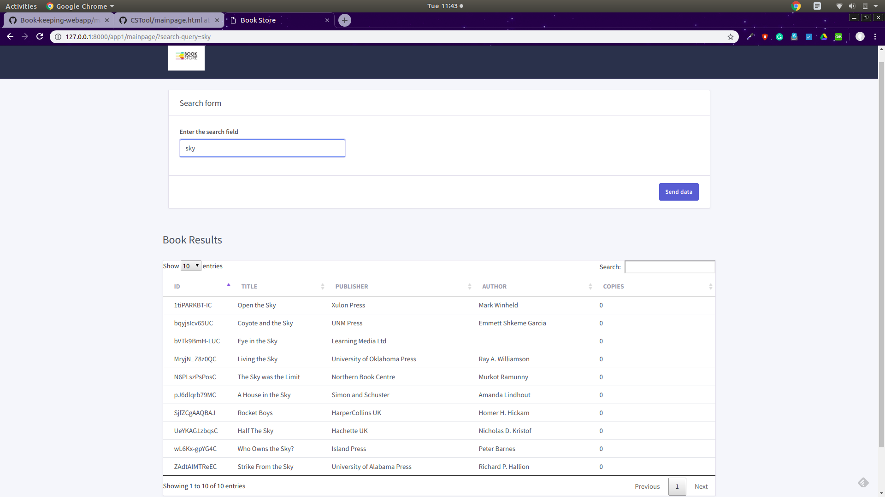
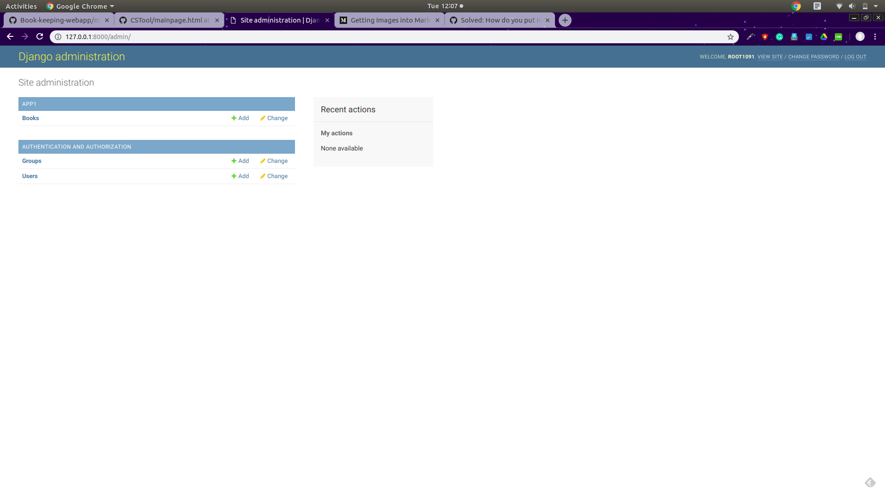
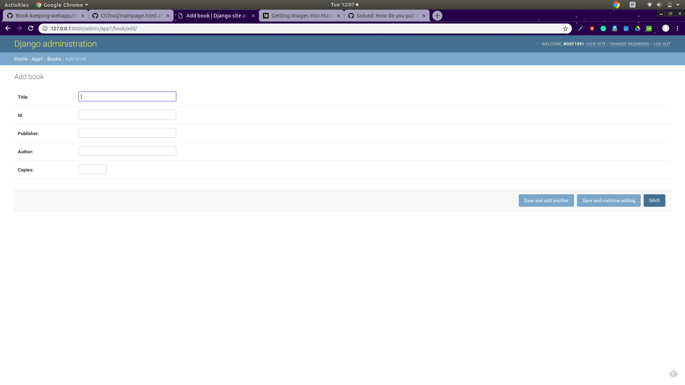

# Book Keeping Webapp

1. cd book_project/

2. Install all the requirements required for the project: pip install -r requirements.txt

3. Run the comand : python manage.py runserver

4. The page which serves book list: http://127.0.0.1:8000/app1/mainpage/ . The search query goes through the list of dictionaries of books and renders it into the webpage in a table format. 

5. The admin page can be created using : python manage.py createsuperuser. Once admin page is created, we have books models, to which new books can be added, updated and deleted, http://127.0.0.1:8000/admin/

6. After logging in, we can make edits to the data present in the model.

### Demonstration

